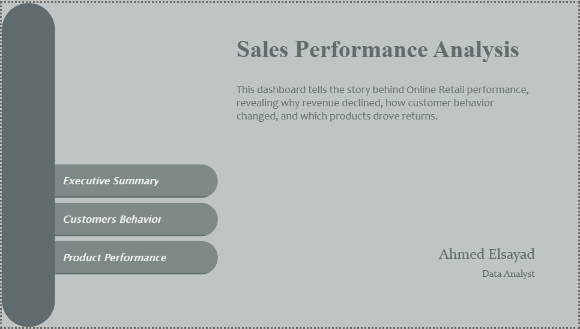
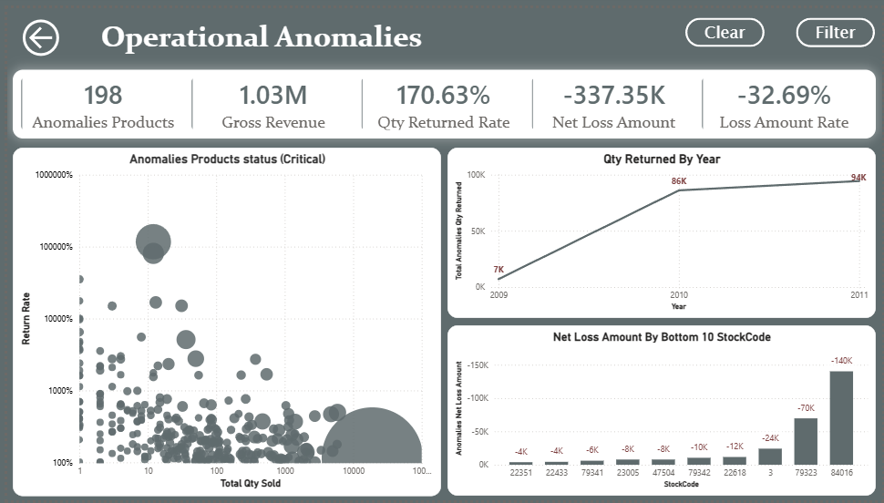

# Sales Performance Analysis

## Project Overview
This project analyzes sales performance using SQL and Power BI to understand the drivers behind a year-over-year sales decline.

## Business Question
Total sales declined by **4.91%** when comparing 2010 to 2011.  
The goal of this analysis is to identify the main factors behind this change.

## Tools Used
- MySQL
- Power BI

## Analysis Workflow
The analysis was conducted in several stages:

1. Database creation
2. Data modeling (Fact & Dimension tables)
3. Sales-Performance-Analysis
4. Customer-Segmentation-RFM
5. Customer-Lifetime-Value
6. Product performance analysis
7. Returns analysis
8. Time series analysis
9. Business insights

## Key Findings
- Orders decreased by **9%**
- Returns dropped by **49.5%**
- Net revenue increased by **7.9%**

The analysis revealed that sales in 2010 were inflated by extremely high return rates caused by a small group of products.

## Dashboard Preview
### Home Page

### Executive Summary

### Customer Behavior

### Product Performance

### Anomalies Detection

### Data Model

## Project Files

- `01-Online-Retail-DB.sql` → Raw dataset creation
- `02-Fact-Tables.sql` → Fact tables creation
- `03-Dim-Tables.sql` → Dimension tables creation
- `04-RFM-CLV-Customer.sql` → Customer segmentation (RFM & CLV)
- `05-Customer-Transition-Summary-Per-Quarter.sql` → Customer behavior over time
- `06-All-Views.sql` → SQL views for analysis
- `07-Customer-Analysis.sql` → Detailed customer analysis
- `08-Products-Performance-Analysis.sql` → Product performance analysis
- `09-Returns-Analysis.sql` → Returns analysis
- `10-Time-Series-Analysis.sql` → Trend & seasonality analysis
- `17-Sales Performance Analysis.pbix` → Power BI dashboard
- `18-Final Report.docx` → Full business report
