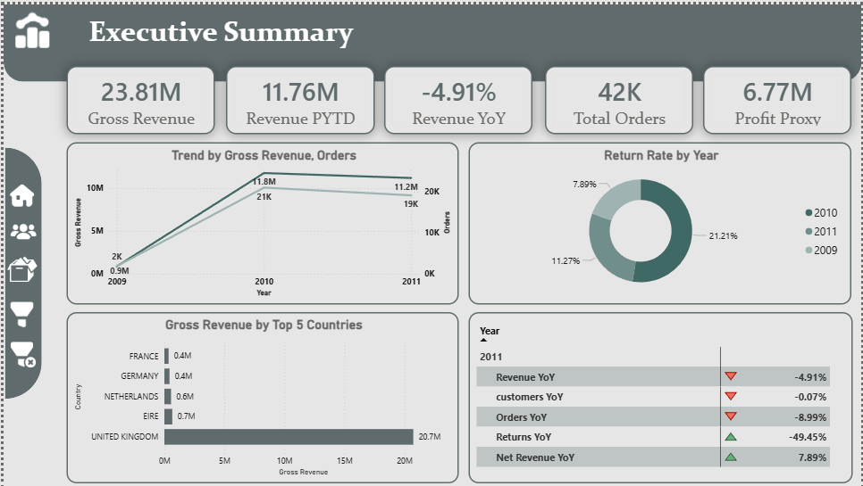
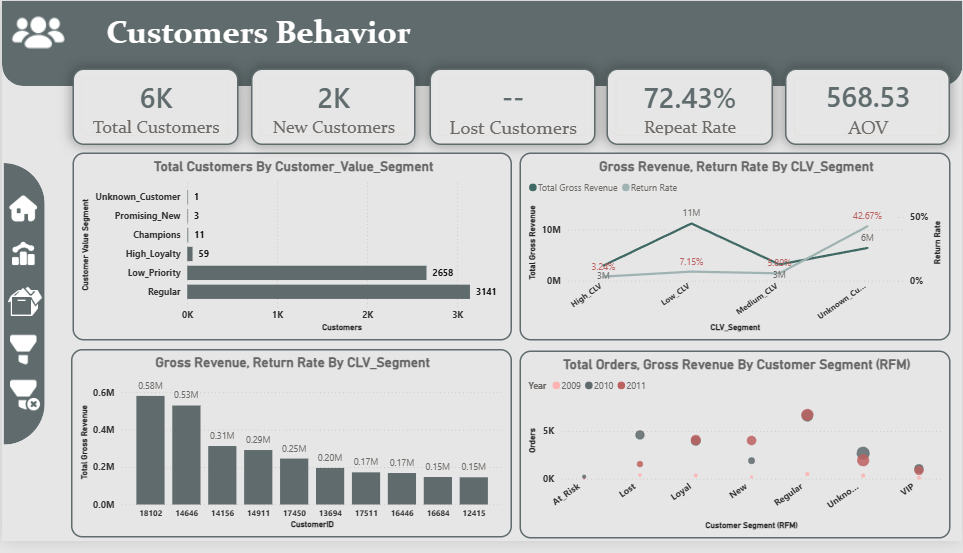
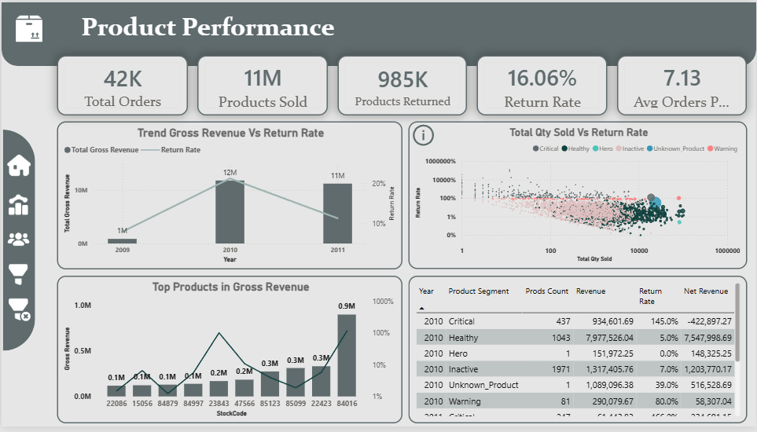
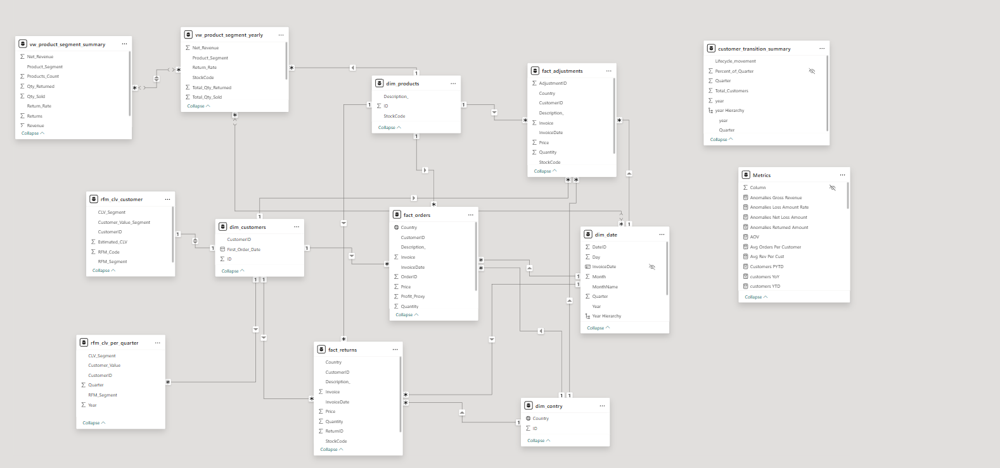

# Sales Performance Analysis

## Project Overview
This project analyzes sales performance using SQL and Power BI to understand the drivers behind a year-over-year sales decline.

## Business Question
Total sales declined by **4.91%** when comparing 2010 to 2011.  
The goal of this analysis is to identify the main factors behind this change.

## Tools Used
- MySQL
- Power BI

## Analysis Workflow
The analysis was conducted in several stages:

1. Database creation
2. Data modeling (Fact & Dimension tables)
3. Customer analysis using RFM segmentation
4. Product performance analysis
5. Returns analysis
6. Time series analysis
7. Business insights

## Key Findings
- Orders decreased by **9%**
- Returns dropped by **49.5%**
- Net revenue increased by **7.9%**

The analysis revealed that sales in 2010 were inflated by extremely high return rates caused by a small group of products.

## Dashboard Preview
### Home Page

### Executive Summary

### Customer Behavior

### Product Performance

### Anomalies Detection

### Data Model

